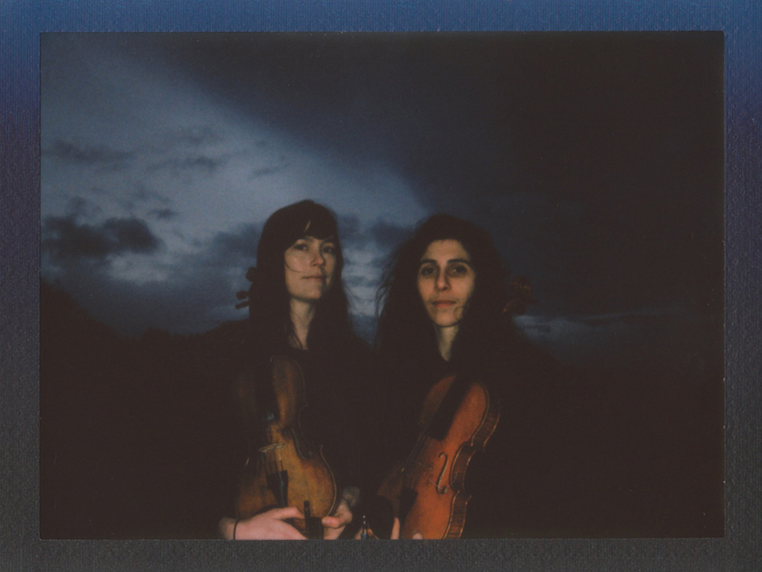
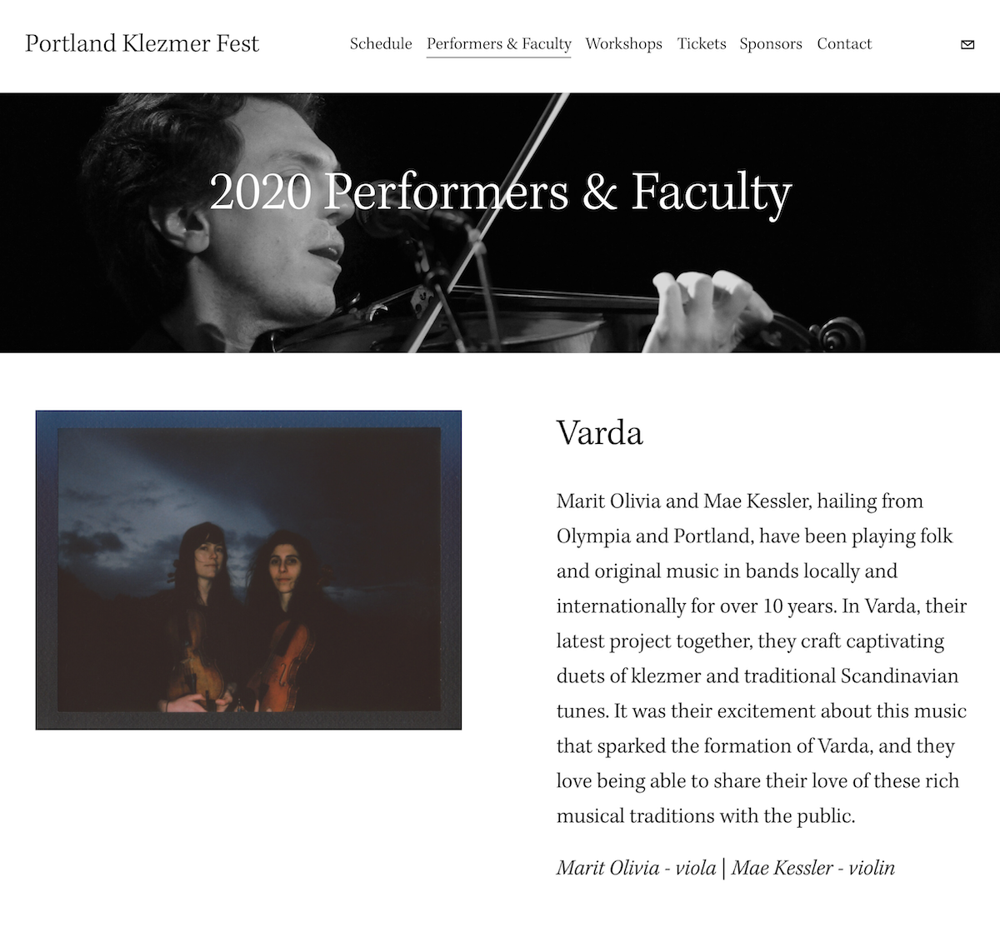

<figure></figure>

Marit Olivia and Mae Kessler, hailing from Olympia and Portland, have been playing folk and original music in bands locally and internationally for over 10 years. In Varda, their latest project together, they craft captivating duets of traditional Eastern European Jewish music (Klezmer) and traditional Scandinavian tunes. It was their excitement about this music that sparked the formation of Varda, and they love being able to share their love of these rich musical traditions with the public.

<h2>In the News</h2>

Listed as performers and faculty for the <a href='https://www.portlandklezmerfest.com/performersandfaculty'>2020 Portland Klezmer Fest</a>. 
<figure></figure>

